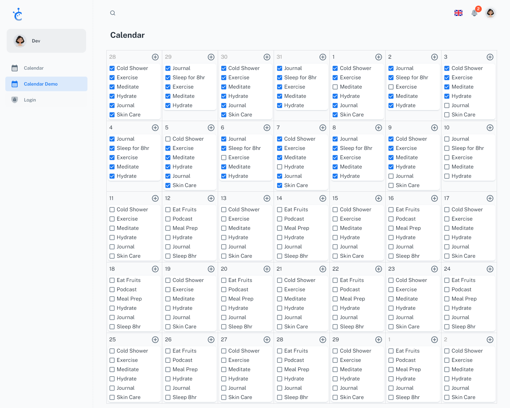

## Daily Tracker [(Beta)](https://daily-tracker-eight.vercel.app/)

> Free React Daily Planner made with Material-UI components and React.

## Quick start

- Recommended `Node.js v18.x`.
- **Install:** `npm install`
- **Start:** `npm run dev`
- **Build:** `npm run build`

## Todo

- [ ] Mobile Friendly
- [ ] Check for empty and duplicate tasks before save
- [ ] SignUp
- [ ] Icon support in text
- [ ] Handle read/write query efficiently(with date and year)
- [ ] Multi Layer tasks
- [ ] Generic Tasks
- [ ] Refresh Token for Login
- [ ] Metrics Graph
- [ ] Dark Mode
- [x] ~~Store Data in DB~~
- [x] ~~Task completion, checkbox~~
- [x] ~~Test Demo link~~
- [x] ~~Change Icon & remove links~~
- [x] ~~Copy tasks~~
- [x] ~~Logout button~~
- [x] ~~Delete Task~~
- [x] ~~Month Change Button~~
- [x] ~~Handle Year change~~

## License

Distributed under the MIT License. See [LICENSE](https://github.com/minimal-ui-kit/minimal.free/blob/main/LICENSE.md) for more information.
